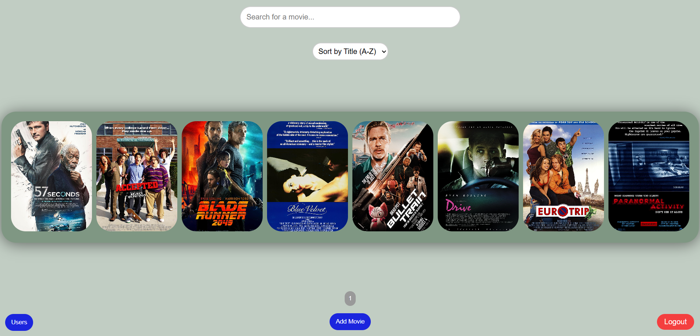
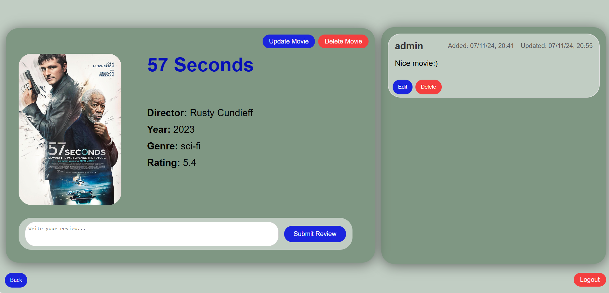

# Movie Web Application

This is a web application for managing movies. Users must register to access its features. Once registered, users can add and modify movie entries, as well as write, edit, and delete reviews or comments for each film. The application includes role-based access control, defining who can perform specific actions and access particular content.
